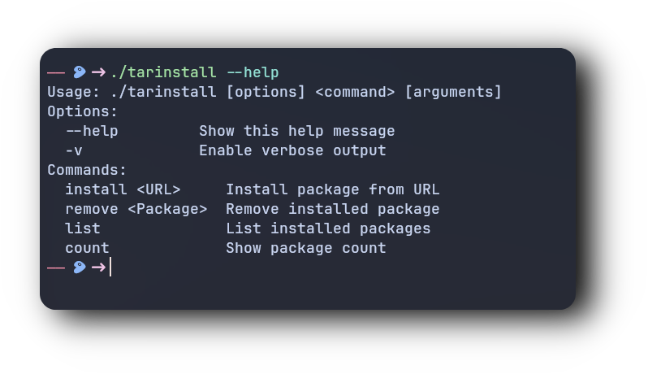
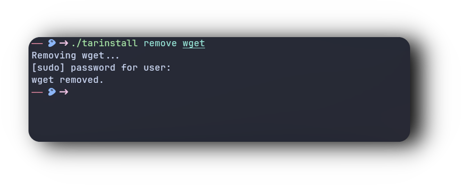
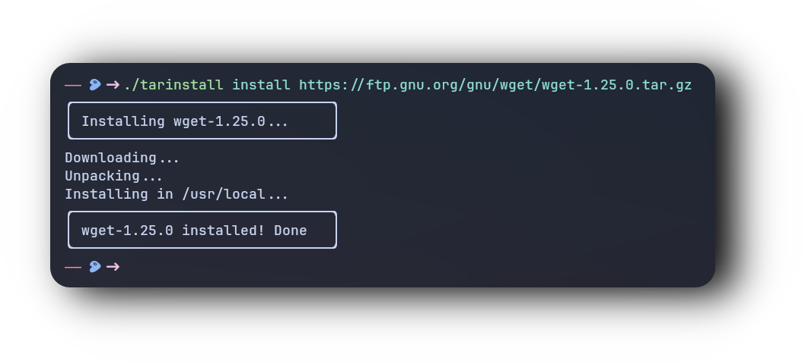

```css
  _______       _____  _____ _   _  _____ _______       _      _      
 |__   __|/\   |  __ \|_   _| \ | |/ ____|__   __|/\   | |    | |     
    | |  /  \  | |__) | | | |  \| | (___    | |  /  \  | |    | |     
    | | / /\ \ |  _  /  | | | . ` |\___ \   | | / /\ \ | |    | |     
    | |/ ____ \| | \ \ _| |_| |\  |____) |  | |/ ____ \| |____| |____ 
    |_/_/    \_\_|  \_\_____|_| \_|_____/   |_/_/    \_\______|______|
```


<h1>
      
</div>
</div> 
  ‎‎‎‎‎‎‎‎‎‎‎‎‎‎‎‎‎‎‎‎‎‎‎‎‎‎‎‎ ‎ ‎ ‎ ‎ ‎ ‎ ‎ ‎ ‎ ‎ ‎ ‎ ‎ ‎ ‎ ‎ ‎ ‎ ‎ ‎ ‎ ‎ ‎ ‎ ‎ ‎ 
‎‎‎‎‎‎‎‎‎‎‎‎‎‎‎‎‎‎‎‎‎‎‎‎‎‎‎‎ ‎ ‎ ‎ ‎ ‎ ‎ ‎ ‎ ‎ ‎ ‎ ‎ ‎ ‎ ‎ ‎ ‎ ‎ ‎ ‎ ‎ ‎ ‎ ‎ ‎ ‎ 
‎‎‎‎‎‎‎‎‎‎‎‎‎‎‎‎‎‎‎‎‎‎‎‎‎‎‎‎ ‎ ‎ ‎ ‎ ‎ ‎ ‎ ‎ ‎ ‎ ‎ ‎ ‎ ‎ ‎ ‎ ‎ ‎ ‎ ‎ ‎ ‎ ‎ ‎ ‎ ‎ 

## ⚙️ Features
- **Install with Links** :bento: Install packages directly from provided URLs.
- **Remove** :blossom: Easily remove installed programs.
- **--help** :rocket: Access the help command for usage instructions.
- **Fast & Minimal** :herb: Designed to be quick and lightweight.
- **Universal** :leaves: Compatible with all Linux distributions.
‎‎‎‎‎‎‎‎‎‎‎‎‎‎‎‎‎‎‎‎‎‎‎‎‎‎‎‎ ‎ ‎ ‎ ‎ ‎ ‎ ‎ ‎ ‎ ‎ ‎ ‎ ‎ ‎ ‎ ‎ ‎ ‎ ‎ ‎ ‎ ‎ ‎ ‎ ‎ ‎ 
‎‎‎‎‎‎‎‎‎‎‎‎‎‎‎‎‎‎‎‎‎‎‎‎‎‎‎‎ ‎ ‎ ‎ ‎ ‎ ‎ ‎ ‎ ‎ ‎ ‎ ‎ ‎ ‎ ‎ ‎ ‎ ‎ ‎ ‎ ‎ ‎ ‎ ‎ ‎ ‎ 
‎‎‎‎‎‎‎‎‎‎‎‎‎‎‎‎‎‎‎‎‎‎‎‎‎‎‎‎ ‎ ‎ ‎ ‎ ‎ ‎ ‎ ‎ ‎ ‎ ‎ ‎ ‎ ‎ ‎ ‎ ‎ ‎ ‎ ‎ ‎ ‎ ‎ ‎ ‎ ‎ 

### :octocat: ‎ <sup><sub><samp>HI THERE! THANKS FOR DROPPING BY!</samp></sub></sup>


<div style="display: flex; align-items: center; margin-bottom: 40px;">
  <div style="flex: 1; padding-right: 20px;">
    <p><strong>🚀 Help Function</strong></p>
<h1>
      
</div>
</div> 
‎‎‎‎‎‎‎‎‎‎‎‎‎‎‎‎‎‎‎‎‎‎‎‎‎‎‎‎ ‎ ‎ ‎ ‎ ‎ ‎ ‎ ‎ ‎ ‎ ‎ ‎ ‎ ‎ ‎ ‎ ‎ ‎ ‎ ‎ ‎ ‎ ‎ ‎ ‎ ‎ 
‎‎‎‎‎‎‎‎‎‎‎‎‎‎‎‎‎‎‎‎‎‎‎‎‎‎‎‎ ‎ ‎ ‎ ‎ ‎ ‎ ‎ ‎ ‎ ‎ ‎ ‎ ‎ ‎ ‎ ‎ ‎ ‎ ‎ ‎ ‎ ‎ ‎ ‎ ‎ ‎ 


<div style="display: flex; align-items: center; margin-bottom: 40px;">
  <div style="flex: 1; padding-right: 20px;">
    <p><strong>📱 Remove Function</strong></p>
<h1>
      
</div>
</div> 

‎‎‎‎‎‎‎‎‎‎‎‎‎‎‎‎‎‎‎‎‎‎‎‎‎‎‎‎ ‎ ‎ ‎ ‎ ‎ ‎ ‎ ‎ ‎ ‎ ‎ ‎ ‎ ‎ ‎ ‎ ‎ ‎ ‎ ‎ ‎ ‎ ‎ ‎ ‎ ‎ 
‎‎‎‎‎‎‎‎‎‎‎‎‎‎‎‎‎‎‎‎‎‎‎‎‎‎‎‎ ‎ ‎ ‎ ‎ ‎ ‎ ‎ ‎ ‎ ‎ ‎ ‎ ‎ ‎ ‎ ‎ ‎ ‎ ‎ ‎ ‎ ‎ ‎ ‎ ‎ ‎ 

## ⚙️ Example Package Repository

#### **https://www.linuxfromscratch.org/lfs/view/stable/wget-list-sysv**

‎‎‎‎‎‎‎‎‎‎‎‎‎‎‎‎‎‎‎‎‎‎‎‎‎‎‎‎ ‎ ‎ ‎ ‎ ‎ ‎ ‎ ‎ ‎ ‎ ‎ ‎ ‎ ‎ ‎ ‎ ‎ ‎ ‎ ‎ ‎ ‎ ‎ ‎ ‎ ‎ ‎‎‎‎‎‎‎‎‎‎‎‎‎‎‎‎‎‎‎‎‎‎‎‎‎‎‎‎ ‎ ‎ ‎ ‎ ‎ ‎ ‎ ‎ ‎ ‎ ‎ ‎ ‎ ‎ ‎ ‎ ‎ ‎ ‎ ‎ ‎ ‎ ‎ ‎ ‎ ‎ 
‎‎‎‎‎‎‎‎‎‎‎‎‎‎‎‎‎‎‎‎‎‎‎‎‎‎‎‎ ‎ ‎ ‎ ‎ ‎ ‎ ‎ ‎ ‎ ‎ ‎ ‎ ‎ ‎ ‎ ‎ ‎ ‎ ‎ ‎ ‎ ‎ ‎ ‎ ‎ ‎ 
‎‎‎‎‎‎‎‎‎‎‎‎‎‎‎‎‎‎‎‎‎‎‎‎‎‎‎‎ ‎ ‎ ‎ ‎ ‎ ‎ ‎ ‎ ‎ ‎ ‎ ‎ ‎ ‎ ‎ ‎ ‎ ‎ ‎ ‎ ‎ ‎ ‎ ‎ ‎ ‎ 

📦 𝘽𝙪𝙞𝙡𝙙 𝙖𝙣𝙙 𝙍𝙪𝙣

To compile and run systop, follow these steps 👇

<div align="center">

```bash
git clone https://github.com/user7210unix/tarinstaller.git
cd tarinstall
chmod +x tarinstall
./tarinstall
