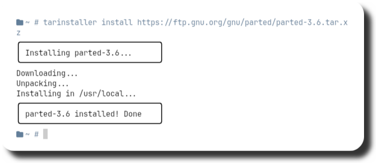
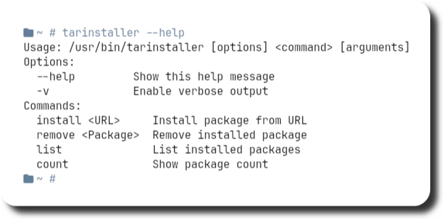

<div align="center">
  <h2 style="font-size: 74px;">
    <strong> 
      <a href="https://user7210unix.github.io/Showcase-website/" style="text-decoration: none; color: inherit;">
        👉 𝗣𝗲𝗿𝘀𝗼𝗻𝗮𝗹 𝗪𝗲𝗯𝘀𝗶𝘁𝗲 👀
      </a> 
    </strong>
  </h2>
</div>


<div align="center">

<h1>
      
</div>
</div> 
  ‎‎‎‎‎‎‎‎‎‎‎‎‎‎‎‎‎‎‎‎‎‎‎‎‎‎‎‎ ‎ ‎ ‎ ‎ ‎ ‎ ‎ ‎ ‎ ‎ ‎ ‎ ‎ ‎ ‎ ‎ ‎ ‎ ‎ ‎ ‎ ‎ ‎ ‎ ‎ ‎ 
‎‎‎‎‎‎‎‎‎‎‎‎‎‎‎‎‎‎‎‎‎‎‎‎‎‎‎‎ ‎ ‎ ‎ ‎ ‎ ‎ ‎ ‎ ‎ ‎ ‎ ‎ ‎ ‎ ‎ ‎ ‎ ‎ ‎ ‎ ‎ ‎ ‎ ‎ ‎ ‎ 
‎‎‎‎‎‎‎‎‎‎‎‎‎‎‎‎‎‎‎‎‎‎‎‎‎‎‎‎ ‎ ‎ ‎ ‎ ‎ ‎ ‎ ‎ ‎ ‎ ‎ ‎ ‎ ‎ ‎ ‎ ‎ ‎ ‎ ‎ ‎ ‎ ‎ ‎ ‎ ‎ 
<div align="center">

## ⚙️ Features
- **Install with Links** :bento: Install packages directly from provided URLs.
- **Remove** :blossom: Easily remove installed programs.
- **--help** :rocket: Access the help command for usage instructions.
- **Fast & Minimal** :herb: Designed to be quick and lightweight.
- **Universal** :leaves: Compatible with all Linux distributions.
‎‎‎‎‎‎‎‎‎‎‎‎‎‎‎‎‎‎‎‎‎‎‎‎‎‎‎‎ ‎ ‎ ‎ ‎ ‎ ‎ ‎ ‎ ‎ ‎ ‎ ‎ ‎ ‎ ‎ ‎ ‎ ‎ ‎ ‎ ‎ ‎ ‎ ‎ ‎ ‎ 
‎‎‎‎‎‎‎‎‎‎‎‎‎‎‎‎‎‎‎‎‎‎‎‎‎‎‎‎ ‎ ‎ ‎ ‎ ‎ ‎ ‎ ‎ ‎ ‎ ‎ ‎ ‎ ‎ ‎ ‎ ‎ ‎ ‎ ‎ ‎ ‎ ‎ ‎ ‎ ‎ 
‎‎‎‎‎‎‎‎‎‎‎‎‎‎‎‎‎‎‎‎‎‎‎‎‎‎‎‎ <div align="center">
‎ ‎ ‎ ‎ ‎ ‎ ‎ ‎ ‎ ‎ ‎ ‎ ‎ ‎ ‎ ‎ ‎ ‎ ‎ ‎ ‎ ‎ ‎ ‎ ‎ ‎ 

### :octocat: ‎ <sup><sub><samp>HI THERE! THANKS FOR DROPPING BY!</samp></sub></sup>
<div align="center">


<div style="display: flex; align-items: center; margin-bottom: 40px;">
  <div style="flex: 1; padding-right: 20px;">
    <p><strong>🚀 Help Function</strong></p>
<h1>
      
</div>
</div> 
‎‎‎‎‎‎‎‎‎‎‎‎‎‎‎‎‎‎‎‎‎‎‎‎‎‎‎‎ ‎ ‎ ‎ ‎ ‎ ‎ ‎ ‎ ‎ ‎ ‎ ‎ ‎ ‎ ‎ ‎ ‎ ‎ ‎ ‎ ‎ ‎ ‎ ‎ ‎ ‎ 
‎‎‎‎‎‎‎‎‎‎‎‎‎‎‎‎‎‎‎‎‎‎‎‎‎‎‎‎ ‎ ‎ ‎‎‎‎‎‎‎‎‎‎‎‎‎‎‎‎‎‎‎‎‎‎‎‎‎‎‎‎‎ ‎ ‎ ‎ ‎ ‎ ‎ ‎ ‎ ‎ ‎ ‎ ‎ ‎ ‎ ‎ ‎ ‎ ‎ ‎ ‎ ‎ ‎ ‎ ‎ ‎ ‎ 
‎‎‎‎‎‎‎‎‎‎‎‎‎‎‎‎‎‎‎‎‎‎‎‎‎‎‎‎ ‎ ‎ ‎ ‎ ‎ ‎ ‎ ‎ ‎ ‎ ‎ ‎ ‎ ‎ ‎ ‎ ‎ ‎ ‎ ‎ ‎ ‎ ‎ ‎ ‎ ‎ 
‎‎‎‎‎‎‎‎‎‎‎‎‎‎‎‎‎‎‎‎‎‎‎‎‎‎‎‎ ‎ ‎ ‎ ‎ ‎ ‎ ‎ ‎ ‎ ‎ ‎ ‎ ‎ ‎ ‎ ‎ ‎ ‎ ‎ ‎ ‎ ‎ ‎ ‎ ‎ ‎ 
 ‎ ‎ ‎ ‎ ‎ ‎ ‎ ‎ ‎ ‎ ‎ ‎ ‎ ‎ ‎ ‎ ‎ ‎ ‎ ‎ ‎ ‎ ‎ 
<div align="center">


<div style="display: flex; align-items: center; margin-bottom: 40px;">
  <div style="flex: 1; padding-right: 20px;">
    <p><strong>📱 Remove Function</strong></p>
<h1>
  ‎‎‎‎‎‎‎‎‎‎‎‎‎‎‎‎‎‎‎‎‎‎‎‎‎‎‎‎ ‎ ‎ ‎ ‎ ‎ ‎ ‎ ‎ ‎ ‎ ‎ ‎ ‎ ‎ ‎ ‎ ‎ ‎ ‎ ‎ ‎ ‎ ‎ ‎ ‎ ‎ 
    
</div>
</div> 
‎‎‎‎‎‎‎‎‎‎‎‎‎‎‎‎‎‎‎‎‎‎‎‎‎‎‎‎ ‎ ‎ ‎ ‎ ‎ ‎ ‎ ‎ ‎ ‎ ‎ ‎ ‎ ‎ ‎ ‎ ‎ ‎ ‎ ‎ ‎ ‎ ‎ ‎ ‎ ‎ 
‎‎‎‎‎‎‎‎‎‎‎‎‎‎‎‎‎‎‎‎‎‎‎‎‎‎‎‎ ‎ ‎ ‎ ‎ ‎ ‎ ‎ ‎ ‎ ‎ ‎ ‎ ‎ ‎ ‎ ‎ ‎ ‎ ‎ ‎ ‎ ‎ ‎ ‎ ‎ ‎ 
‎‎‎‎‎‎‎‎‎‎‎‎‎‎‎‎‎‎‎‎‎‎‎‎‎‎‎‎ ‎ ‎ ‎ ‎ ‎ ‎ ‎ ‎ ‎ ‎ ‎ ‎ ‎ ‎ ‎ ‎ ‎ ‎ ‎ ‎ ‎ ‎ ‎ ‎ ‎ ‎ 

‎‎‎‎‎‎‎‎‎‎‎‎‎‎‎‎‎‎‎‎‎‎‎‎‎‎‎‎ ‎ ‎ ‎ ‎ ‎ ‎ ‎ ‎ ‎ ‎ ‎ ‎ ‎ ‎ ‎ ‎ ‎ ‎ ‎ ‎ ‎ ‎ ‎ ‎ ‎ ‎ 
‎‎‎‎‎‎‎‎‎‎‎‎‎‎‎‎‎‎‎‎‎‎‎‎‎‎‎‎ ‎ ‎ ‎ ‎ ‎ ‎ ‎ ‎ ‎ ‎ ‎ ‎ ‎ ‎ ‎ ‎ ‎ ‎ ‎ ‎ ‎ ‎ ‎ ‎ ‎ ‎
‎‎‎‎‎‎‎‎‎‎‎‎‎‎‎‎‎‎‎‎‎‎‎‎‎‎‎‎ ‎ ‎ ‎ ‎ ‎ ‎ ‎ ‎ ‎ ‎ ‎ ‎ ‎ ‎ ‎ ‎ ‎ ‎ ‎ ‎ ‎ ‎ ‎ ‎ ‎ ‎ ‎‎‎‎‎‎‎‎‎‎‎‎‎‎‎‎‎‎‎‎‎‎‎‎‎‎‎‎ ‎ ‎ ‎ ‎ ‎ ‎ ‎ ‎ ‎ ‎ ‎ ‎ ‎ ‎ ‎ ‎ ‎ ‎ ‎ ‎ ‎ ‎ ‎ ‎ ‎ ‎ 
‎‎‎‎‎‎‎‎‎‎‎‎‎‎‎‎‎‎‎‎‎‎‎‎‎‎‎‎ ‎ ‎ ‎ ‎ ‎ ‎ ‎ ‎ ‎ ‎ ‎ ‎ ‎ ‎ ‎ ‎ ‎ ‎ ‎ ‎ ‎ ‎ ‎ ‎ ‎ ‎ 
‎‎‎‎‎‎‎‎‎‎‎‎‎‎‎‎‎‎‎‎‎‎‎‎‎‎‎‎ ‎ ‎<div align="center">
 ‎ ‎ ‎ ‎ ‎ ‎ ‎ ‎ ‎ ‎ ‎ ‎ ‎ ‎ ‎ ‎ ‎ ‎ ‎ ‎ ‎ ‎ ‎ ‎ 

📦 𝘽𝙪𝙞𝙡𝙙 𝙖𝙣𝙙 𝙍𝙪𝙣

To compile and run systop, follow these steps 👇

<div align="center">

```bash
git clone https://github.com/user7210unix/tarinstaller.git
cd tarinstaller
chmod +x tarinstaller
sudo cp -r tarinstaller /usr/bin/
cd $HOME
tarinstaller --help
